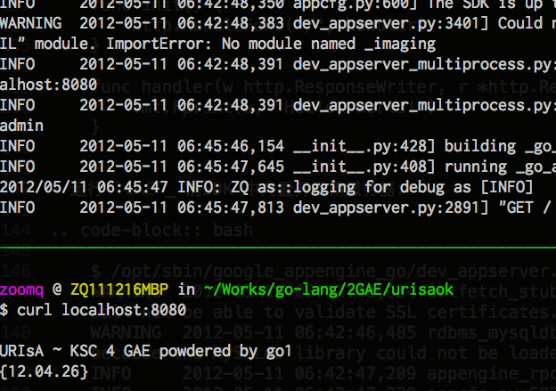
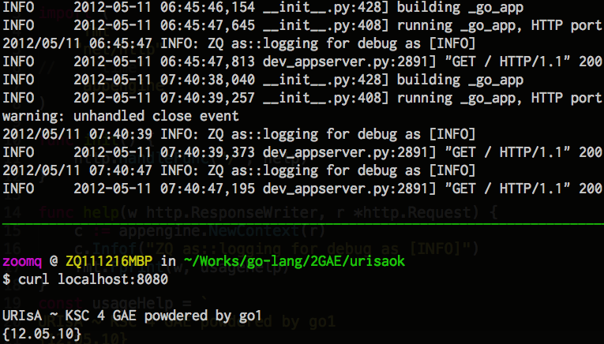
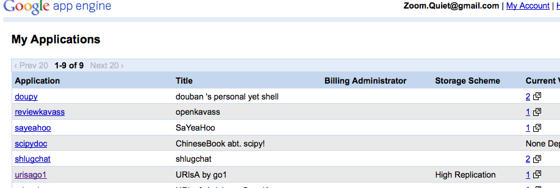
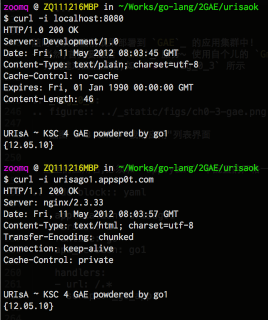

.. include:: ../LINKS.rst

00:00" 初尝
==============

整起来先!
- 嗯嗯嗯,现在可以计时了: `00:00`

安装
--------

根据: `Getting Started - The Go Programming Language <http://golang.org/doc/install>`_

- 选择对应操作系统的版本
- 快速完成安装

.. sidebar:: 提示

    - 不专门说明的话,指的都是笔者的个人环境:

      - MacOS X 10.7
      - `Go`_ 1.0.1

    - 不过,真心兼容所有 Linux 发行版环境的!
    - 另外在引用中文本中:
    - `$` 表示以普通用户,在命令行环境中的操作;
    - `#` 表示以`root`身份,在命令行环境中的操作;

::

    $ /usr/local/bin/go version
    go version go1.0.1

- 当然,正常的话,是直接 `go version` 檢查的,,,

根据 `Downloads - Google App Engine — Google Developers <https://developers.google.com/appengine/downloads>`_ 下载对应系统的对应SDK

- 比如说笔者就是: `go_appengine_sdk_darwin_amd64-1.6.5.zip`

::

    $ /opt/sbin/google_appengine_go/go version
    go version go1 (appengine-1.6.5)

- 当然的, `GAE`_ 中集成的 `Go`_ 是定制过的
- 当然的, 安裝到 `/opt/sbin` 只是笔者的个人恶趣味, 大家可以安装到任意自个儿习惯的目录中,,,

Hollo World 
------------------------------

一切语言,好象都流行从 `Hollo World!` 开始, `Go`_ 也一样

参考: `Go 指南 <http://go-tour-zh.appsp0t.com/#1>`_

- `mikespook <https://bitbucket.org/mikespook/go-tour-zh/overview>`_ 翻译并发布到 `GAE`_ 的 `Go`_ 自学指南 ;-)
- 创建: `hollo.go`

.. code-block:: go

    package main

    import "fmt"

    func main() {
      fmt.Println("Hollo, 世界")
    }

- 使用标准 `Go`_ 运行:

.. code-block:: bash

    $ /usr/local/bin/go run hollo.go 
    Hollo, 世界

- 使用 `GAE`_ 包装的 `Go`_ 运行:

.. code-block:: bash

    $ /opt/sbin/google_appengine_go/go run hollo.go 
    Hello, 世界

效果一致! 不过,俺是要丢到 `GAE`_ 里运行的,所以要:

本地测试开发服务器
-------------------------

参考: `开始Go`_ 的官方文档

- 准备好目录:

::

    urisaok/
    +- hollo
    |   `- hollo.go
    `-  app.yaml

- 初始化 `app.yaml`

.. code-block:: yaml

    application: urisago1
    version: 1
    runtime: go
    api_version: go1

    handlers:
    - url: /.*
      script: _go_app

- 照抄 `hello.go`

.. code-block:: go

    package hello

    import (
        "fmt"
        "net/http"
    )

    func init() {
        http.HandleFunc("/", handler)
    }

    func handler(w http.ResponseWriter, r *http.Request) {
        fmt.Fprint(w, "Hello, world!")
    }

- 运行 `GAE`_ 的SDK 中内置开发用服务器:

::

    $ /opt/sbin/google_appengine_go/dev_appserver.py urisaok/
    WARNING  2012-05-11 06:42:46,354 urlfetch_stub.py:111] No ssl package found. urlfetch will not be able to validate SSL certificates.
    WARNING  2012-05-11 06:42:46,485 rdbms_mysqldb.py:74] The rdbms API is not available because the MySQLdb library could not be loaded.
    INFO     2012-05-11 06:42:47,209 appengine_rpc.py:160] Server: appengine.google.com
    INFO     2012-05-11 06:42:47,239 appcfg.py:582] Checking for updates to the SDK.
    INFO     2012-05-11 06:42:48,350 appcfg.py:600] The SDK is up to date.

.. note:: (~_~)

    - `dev_appserver.py` 要运行在应用目录之上
    - 比如说,俺的开发目录是: `~/Works/go-lang/2GAE/urisaok`
    - 那么运行 SDK 就应该在: `~/Works/go-lang/2GAE/`
    - 否则 `app.yaml` 是找不到的,,,

用 `tmux`_ 分割窗口,就可以同时看到 `dev_appserver.py` 运行日志,以及测试的输出,
如 :ref:`fig_0_1`

.. _fig_0_1:

   插图.0-1 用 `cURL`_ 测试接口

嗯嗯嗯,看起来和代码写的不一样? 因为...

::

    // ...
    func help(w http.ResponseWriter, r *http.Request) {
        c := appengine.NewContext(r)
        c.Infof("ZQ as::logging for debug as [INFO]")
        fmt.Fprint(w, usageHelp)
    }
    const usageHelp = `
    URIsA ~ KSC 4 GAE powdered by go1
    {12.04.26}
    `

- 根据 `Go日志Reference <https://developers.google.com/appengine/docs/go/log/reference>`_

::
    
    // 如下,可以随时将好奇的运行时数据,吼到 dev_server.py 的运行输出中
    c.Infof("ZQ as::logging for debug as [INFO]")

- 并使用了 `Constant expressions` ~ 常量表达式
- 声明多行文本来输出,比在单行里手工增加 `\\n \\t` 什么的格式符要直觉的多...

PS:
    而且 `GAE`_ 的 SDK 为本地开发调试,内置了非常友愛的功能, :ref:`fig_0_2`

.. _fig_0_2:

   插图.0-2 dev_server.py 会自动编译变动过的代码再运行

- 注意观察上方的日志输出
- 一但代码有变动, `dev_server.py` 能感知到,并先尝试编译再重启!
- 如果没有变动,第二次访问,就没有 `building` 行为了,,,

部署上线!
-------------------

使用 SDK 内置的部署工具: `appcfg.py`

::

    $ /opt/sbin/google_appengine_go/appcfg.py update urisaok/
    Application: urisago1; version: 1
    Host: appengine.google.com

    Starting update of app: urisago1, version: 1
    Getting current resource limits.
    Scanning files on local disk.
    Cloning 5 application files.
    Uploading 1 files and blobs.
    ...
    Checking if deployment succeeded.
    Deployment successful.
    Checking if updated app version is serving.
    Completed update of app: urisago1, version: 1

随时可以将当前成果部署到 `GAE`_ 的应用集群中!

- 当然,首先要激活 `GAE`_ 服务~ 使用自个儿的 `Gmail`_ 帐号
- 并创建对应的应用,如 :ref:`fig_0_3` 所示

.. _fig_0_3:

   插图.0-3 GAE中"我的应用"列表界面

- 这里的应用名,必须和 `app.yaml` 中配置的严格一致!

.. code-block:: yaml

    application: urisago1
    version: 1
    runtime: go
    api_version: go1

    handlers:
    - url: /.*
      script: _go_app

然后,就可以访问 `GAE`_ 中的应用了,,,

- 如 :ref:`fig_0_4` 所示

.. _fig_0_4:

   插图.0-4 对比线上 `GAE`_ 应用测试

- 使用 `cURL`_ 的 `-i` 参数就可以观察到服务器返回的头信息
- 可以注意到 `GAE`_ 使用 `Nginx`_ 作Web服务器! ~ 不过那个版本号一看就知道是自个儿山寨的 `~.~`

7:01" 小结
------------------

不出意外的话, 七分钟 用在这个阶段,很足够了!

- 因为,一共 20 行代码
- 90% 都有的抄
- 关键是先要习惯,并建立起,依托 `GAE`_ 的 `Go`_ 应用开发流程:

::

      dev_server.py 运行起本地应用
        `->修订代码
            ^ `-> cURL 测试
            |           |
            +-----------/

.. seealso:: (^.^)
    
    - 如 `Hello, World! - Google App Engine — Google Developers <https://developers.google.com/appengine/docs/go/gettingstarted/helloworld>`_ 中所述
    - `_go_app` 是个魔法词,会自动找到指定目录中的 `*.go` 进行编译尝试...

