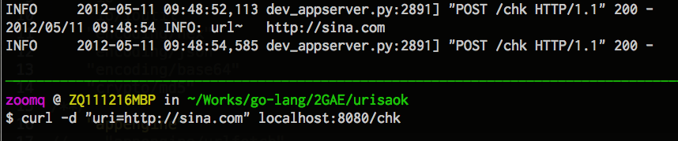
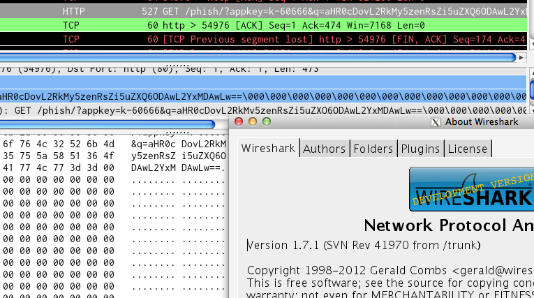
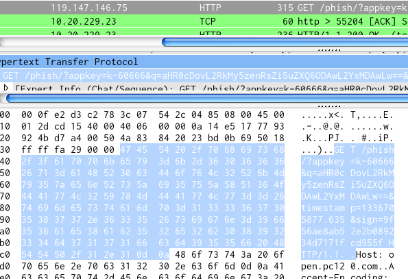

.. include:: ../LINKS.rst

7:42" 突入 
==============

嗯嗯嗯,现在可以开始计时了...

.. note:: (~_~)

    - 新手就是新手,没有帮助是会崩溃的,所以,,,
    - 一定要订阅相关的开发列表( `maillist`_ )
    - 官方的忒活跃了,而且都是E文, 如 :ref:`fig_1_0`
    - 所以,推荐中国弟兄们簇集的 `Golang-China <http://groups.google.com/group/golang-china>`_

.. _fig_1_0:

   插图.1-0 `golang-nuts <http://groups.google.com/group/golang-nuts>`_ 官方主力列表

URIsAok
-----------------------

对于,我们的目标任务: 包装 `金山网址云安全开放API <http://code.ijinshan.com/api/devmore4.html#md1>`_ 为 `REST`_ 在线服务; 

不用研究透 `Go`_ ,仅仅需要作到以下几点,就可以完成核心功能了:

- 对指定 URL 接收 `POST` 方式提交来的待查网址
- 根据文档, 对查询参数项进行合理的 `base64` / `md5` 编码
- 向 `金山网址云API`_ 发起合理请求,并解析返回的 `JSON`_ 格式数据

获得POST数据
^^^^^^^^^^^^^^^^^^^^^^^
有的抄 ;-)

- 参考: `Handling Forms - Google App Engine — Google Developers <https://developers.google.com/appengine/docs/go/gettingstarted/handlingforms>`_

::

    ...
    func init() {
        http.HandleFunc("/", root)
        http.HandleFunc("/sign", sign)
    }

    ...
    func sign(w http.ResponseWriter, r *http.Request) {
        err := signTemplate.Execute(w, r.FormValue("content"))

就可以得出:

.. code-block:: go

    package urisa

    import (
        "fmt"
        "net/http"
        
        "appengine"
    )

    func init() {
        http.HandleFunc("/", help)
        http.HandleFunc("/chk", chk)
    }

    func help(w http.ResponseWriter, r *http.Request) {
        fmt.Fprint(w, usageHelp)
    }
    const usageHelp = `
    URIsA ~ KSC 4 GAE powdered by go1
    {v12.05.3}
    usage:
        $ curl -d "uri=http://sina.com" urisago1.appsp0t.com/chk
    `
    func chk(w http.ResponseWriter, r *http.Request) {
        c := appengine.NewContext(r)
        url := r.FormValue("uri")
        c.Infof("url~\t %v\n", url)
    }

如 :ref:`fig_1_1` 所示:

.. _fig_1_1:

   插图.1-1 使用 `cURL`_ 测试POST数据捕获

完全吻合预期, 增补了两招儿:

- 使用 `http.HandleFunc("/chk", chk)` 声明了守候的路由
- 使用 `r.FormValue("uri")` 直接抓到 POST 来的数据

时间戳
^^^^^^^^^^^^^^^^^^^^^^^

根据 `金山网址云API`_ 文档, 需要形如 `1336730157.204` 的 `Unix时间戳(Unix timestamp) <http://tool.chinaz.com/Tools/unixtime.aspx>`_

- 官方包,当然有的了: `func Unix(sec int64, nsec int64) Time <http://golang.org/pkg/time/#Unix>`_
- 问题是返回的是整数吼,没有小数点后3位!
- 再细看的,有 `func (t Time) UnixNano() int64 <http://golang.org/pkg/time/#Time.UnixNano>`_

可是怎么使用?

- 返回的 `int64` 长整数,如何可以格式化为有3个小数的浮点数? 或是字串?
- 吼了列表没有获得及时指点,就使用以往经验:

    - 硬来!
    - 总是可以将整数变成字串
    - 然后使用字串格式化的方式输出想要的形式

果然!

- 有 `strconv <http://golang.org/pkg/strconv/>`_ 字串整形包!
- 进一步的,定位到 `func FormatInt(i int64, base int) string <http://golang.org/pkg/strconv/#FormatInt>`_

    - 囧的是: `FormatUint returns the string representation of i in the given base`
    - 这个 `base` 神马意思?!

::

    now := time.Now()
    c.Infof("%v , %v", now.Unix(), now.UnixNano())
    nano := strconv.FormatInt(now.UnixNano(),2)
    c.Infof("timestamp ~ %v", nano)

先如此尝试一下,,,

- 可以运行,输出: `timestamp ~ 1001010001101000001011110011100000100110011111110100011000000`
- `FormatInt(now.UnixNano(),3)` ,输出: `timestamp ~ 22220110102022002202120220120110211221`
- `FormatInt(now.UnixNano(),4)` ,输出: `timestamp ~ 112150136724241452010`
- 嗯嗯嗯?! 有点儿感觉了,使用 `FormatInt(now.UnixNano(),16)` ?!

    - 果然输出: `timestamp ~ 128d05f359d03738`
    - 原来! 这 `base` 就是制式的意思
    - `FormatInt()` 能将整数,处理成指定制式的数字! 从二进制到16进制!

比照 `Python`_ 中的时间戮::

    $ ipython
    Python 2.7.1 (r271:86832, Jul 31 2011, 19:30:53) 
    Type "copyright", "credits" or "license" for more information.

    In [1]: import time

    In [2]: "%.3f"% time.time()
    Out[2]: '1336731591.484'

完成 `Go`_ 的::

    now := time.Now()
    nano := strconv.FormatInt(now.UnixNano(),10)
    c.Infof("timestamp ~ %v %v.%v", nano, nano[0:10],nano[10:13])

MD5
^^^^^^^^^^^^^^^^^^^^^^^

这个太常用了,必然的: `md5 - The Go Programming Language <http://golang.org/pkg/crypto/md5/>`_

样例Code::

    h := md5.New()
    io.WriteString(h, "The fog is getting thicker!")
    io.WriteString(h, "And Leon's getting laaarger!")
    fmt.Printf("%x", h.Sum(nil))

Output::

    e2c569be17396eca2a2e3c11578123ed

忒直觉了!

直接抄! ::

    ...
    h := md5.New()
    io.WriteString(h, url )
    c.Infof("sign~\t %v\n", hex.EncodeToString(h.Sum(nil)))

齐活!

base64
^^^^^^^^^^^^^^^^^^^^^^^

老规律,一找一准: `base64 - The Go Programming Language <http://golang.org/pkg/encoding/base64/>`_

只是,文档死活没看明白:

- `func (enc *Encoding) DecodedLen(n int) int` 这儿的 `*Encoding` 从哪儿来的?
- `func NewEncoder(enc *Encoding, w io.Writer) io.WriteCloser` 看起来是创建编码器的函式,也同样需要 `*Encoding` 类型的实例...

从 `golang-nuts` 搜索出旧讨论的相关代码::

    //for example:
    package main

    import (
            "os"
            "io"
            "encoding/base64"
            "strings"
            )

    func main() {
            r := base64.NewDecoder(base64.StdEncoding,
    strings.NewReader("SGV5LCBCaW5nbyEh"))
            io.Copy(os.Stdout, r)

    } 

- 噢去噢?! 原来文档中::

    Variables

    var StdEncoding = NewEncoding(encodeStd)

        StdEncoding is the standard base64 encoding, as defined in RFC 4648.

    var URLEncoding = NewEncoding(encodeURL)

        URLEncoding is the alternate base64 encoding defined in RFC 4648. It is typically used in URLs and file names.

- 这两变量,就是包内置的专用编码器实例对象!
- 但是 `io.WriteCloser` 这东西怎么生成的呢?
- 吼到 中文列表~ `Golang-China`_, 好人提醒::

    dst := make([]byte, 256) 
    base64.URLEncoding.Encode(dst, []byte(url))
    c.Infof("base64~\t %v\n", string(dst))

- 打印的日志类似::

    16:24:49 INFO: base64~        aHR0cDovL3NpbmEuY29t

哗! DONE!

外网请求(urlfetch)
^^^^^^^^^^^^^^^^^^^^^^^

这种行为有关安全, `GAE`_ 有专用包,不能直接使用 内置 `http` 包里的:

- `URL Fetch Go API Overview <https://developers.google.com/appengine/docs/go/urlfetch/overview>`_
- 参考样例 ::

    import (
        "fmt"
        "net/http"

        "appengine"
        "appengine/urlfetch"
    )

    func handler(w http.ResponseWriter, r *http.Request) {
        c := appengine.NewContext(r)
        client := urlfetch.Client(c)
        resp, err := client.Get("http://www.google.com/")
        if err != nil {
            http.Error(w, err.Error(), http.StatusInternalServerError)
            return
        }
        fmt.Fprintf(w, "HTTP GET returned status %v", resp.Status)
    }

- 读起来很流畅,只是 最后输出的只是 `resp.Status` 服务器返回状态,俺要的是整个返回数据!
- 继续追查文档,原来,的确有举例,,, ::

    ...
    if resp.StatusCode != 200 {
        http.Error(w, "couldn't get sale data", http.StatusInternalServerError)
        return
    }
    defer resp.Body.Close()
    parseCSV(resp.Body)

- `resp.Body` 就是! 所以::

    resp, err := client.Get("http://open.pc120.com/phish/")
    if err != nil {
        http.Error(w, err.Error(), http.StatusInternalServerError)
        return
    }
    c.Infof("HTTP GET returned status %v", resp.Status)
    if resp.StatusCode != 200 {
        http.Error(w, "couldn't get sale data", http.StatusInternalServerError)
        return
    }
    defer resp.Body.Close()
    var buf []byte
    buf, _ = ioutil.ReadAll(resp.Body)
    c.Infof("resp.Body %v", string(buf))

- 运行日志类似::

    16:36:19 INFO: HTTP GET returned status 200 OK
    16:36:19 INFO: resp.ContentLength 56
    16:36:19 INFO: resp.Body {"success":0,"errno":-7,"msg":"appkey,q,sign,timestamp"}

- 非常对味儿,因为没有 POST 数据访问时, 金山云是返回错误信息的,当然,是 `JSON`_ 格式

JSON 解析
^^^^^^^^^^^^^^^^^^^^^^^

好的,最后一个环节了!

- 有标准包的: `json - The Go Programming Language <http://golang.org/pkg/encoding/json/>`_
- 但是,使用时,问题也是最多的,一搜索,到处都是吐糟,,,
- 而且,杯具的是, go1 的 `json` 包,和以前的接口不一致,旧代码搜索出来无法使用
- 只好吼中文列表~ `Golang-China`_
- 再综合多方代码片段,得到::

    ...

    defer resp.Body.Close()
    var buf []byte
    buf, _ = ioutil.ReadAll(resp.Body)
    c.Infof("resp.Body %v", string(buf))

    type KSC struct {
        Success int     //`json:"success"`
        Phish   int     //`json:"phish"`
        Msg     string  //`json:"msg"`
    }
    result := &KSC{}
    err = json.Unmarshal(buf, result)
    if err != nil {
        panic(err)
        //http.Error(w, err.Error(), http.StatusInternalServerError)
        return
    }

- 参考: `金山网址云API`_ 文档,明确服务端返回的 `JSON`_ 数据结构
- 然后 ,先使用 `Go`_ 的结构类型,创建对等的数据结构
- 最后使用, `func Unmarshal(data []byte, v interface{}) error` 解析就好
- 这儿唯一纠结的就是结构体的声明 `(~_~)`

    - 在文档的 `func Marshal <http://golang.org/pkg/encoding/json/#Marshal>`_ 部分
    - 提及了声明结构时,对齐 `JSON`_ 数据的技巧
    - 如果不认真,或是 E差,绝对不知道以上形式了,,,

::

    type KSC struct {
        Success int     //`json:"success"`
        ...

这里包含一堆约定:
    - 结构字段名,必须首字母大写,否则,不工作!
    - 注释中的 `json:"success"` 指出将对应哪个 `JSON`_ 字段
    - 其实, `Go`_ 结构体字段,不必逐一对齐 `JSON`_ 的,需要使用什么,就声明什么好了

这里包含的 `Go`_ 哲学:
    - `表让俺猜!`
    - 要解析什么数据,事先一定要吼明确
    - 这样,发生了什么问题,在哪儿有偏差,都在代码中有对应的显然表述!
    - 不象 `Python`_ 会自动帮忙作很多事儿,开始感觉很方便,但是,一但出问题,就只能直接到内存中追了...

整个儿的
------------------------

其实是完全一一对照原先 `Python`_ 版本的代码

::

    def __genQueryArgs(api_path, url):
        args = "appkey=" + cfg.APPKEY
        args += "&q=" + base64.urlsafe_b64encode(url)
        args += "&timestamp=" + "%.3f" % (time.time())
        sign_base_string = api_path + "?" + args
        args += "&sign=" + md5(sign_base_string + cfg.SECRET).hexdigest()
        return args

    def _askCloud(api_path, url):
        args = __genQueryArgs(api_path, url)
        api_url = "http://%s%s?%s"% (cfg.OPEN_HOST, cfg.APITYPE ,args)
        print api_url
        result = eval(urilib.urlopen(api_url).read())
        print result
        if result['success'] == 1:
            return result['phish']
        else:
            return result

进行迁移的而已:

.. code-block:: go

    package urisa

    import (
        "fmt"
        "net/http"
        "time"
        "strconv"
        "io"
        "io/ioutil"
        "encoding/hex"
        "encoding/json"
        "encoding/base64"
        "crypto/md5"
        "appengine"
        "appengine/urlfetch"
    )
    
    // ...

    var APPKEY  = "k-60666"
    var SECRET  = "99fc9fdbc6761f7d898ad25762407373"
    var APIHOST = "open.pc120.com"
    var APITYPE = "/phish/"
    var PHISHID = map[int] string {
        -1:   "UNKNOW",
        0:    "GOOD",
        1:    "PHISH!",
        2:    "MAYBE...",
    }
    func chk(w http.ResponseWriter, r *http.Request) {
        c := appengine.NewContext(r)
        url := r.FormValue("uri")

        dst := make([]byte, 256)
        base64.URLEncoding.Encode(dst, []byte(url))
        c.Infof("base64~\t %v\n", string(dst))

        args := "appkey=" + APPKEY
        args += "&q=" + string(dst)
        now := time.Now()
        nano := strconv.FormatInt(now.UnixNano(),10)
        c.Infof("timestamp ~ %v %v.%v", nano, nano[0:10],nano[10:13])
        args += "&timestamp=" + nano[0:10] + "." + nano[10:13]
        sign_base_string := APITYPE + "?" + args 
        c.Infof("sign_base_string~\t %v\n", sign_base_string)
        //md5 hash 严格参数顺序:: appkey -> q -> timestamp
        h := md5.New()
        io.WriteString(h, sign_base_string + SECRET)
        args += "&sign=" + hex.EncodeToString(h.Sum(nil))
        c.Infof("sign~\t %v\n", hex.EncodeToString(h.Sum(nil)))
        c.Infof("args~\t %v\n", args)

        api_url := "http://"+ APIHOST + APITYPE + "?" + args 
        c.Infof("api_url~ \n%v", api_url)

        client := urlfetch.Client(c)
        resp, err := client.Get(api_url)
        if err != nil {
            http.Error(w, err.Error(), http.StatusInternalServerError)
            return
        }
        c.Infof("HTTP GET returned status %v", resp.Status)
        if resp.StatusCode != 200 {
            http.Error(w, "couldn't get sale data", http.StatusInternalServerError)
            return
        }
        defer resp.Body.Close()
        c.Infof("resp.ContentLength %v", resp.ContentLength)
        var buf []byte
        buf, _ = ioutil.ReadAll(resp.Body)
        c.Infof("resp.Body %v", string(buf))

        type KSC struct {
            Success int     //`json:"success"`
            Phish   int     //`json:"phish"`
            Msg     string  //`json:"msg"`
        }
        result := &KSC{}
        err = json.Unmarshal(buf, result)
        if err != nil {
            panic(err)
            //http.Error(w, err.Error(), http.StatusInternalServerError)
            return
        }
        pishmsg, _ := PHISHID[result.Phish]

        c.Infof("Success:%v \n Phish:%s", result.Success ,pishmsg)
        fmt.Fprint(w, "/chk(KCS):\t" + pishmsg)
    }

这儿的唯一技巧是:

- `panic(err)` 这将完全的输出錯誤栈,完整的打印錯誤时的运行状态,以便调试!

200->400 ?!@#@$!%$#%^5467
^^^^^^^^^^^^^^^^^^^^^^^^^^^^^^^^^^

但是! 杯具了! 怎么运行都失败,死也获得不了正确的返回,,,

- 而且詭异的是,日志中出现::

    2012/05/11 03:16:00 INFO: HTTP GET returned status 200 OK
    2012/05/11 03:16:00 INFO: resp.ContentLength 173
    2012/05/11 03:16:00 INFO: resp.Body <html>
    <head><title>400 Bad Request</title></head>
    <body bgcolor="white">
    
<h1>400 Bad Request</h1>

    

nginx/1.0.11

    </body>
    </html>

- 先 200 ,然后输出的页面却是 400 ,这前后两种完全不同的 http 状态,在一个请求中出现?!
- 使用二分法,逐步缩小可疑代码, 发觉是组装成的查询 url 有问题
- 不论怎么嘗試, 金山云一直返回类似 `{"success":0,"errno":-7,"msg":"appkey,q,sign,timestamp"}` 的据錯!
- 但是,打印出来的查詢字串,怎么看和文档中的也完全类似哪...

再次向 中文列表~ `Golang-China`_ 求助

- 好人们建议, 使用专用工具探查,真实的网络访问吧...

于是!

tcpdump
^^^^^^^^^^^^^^^^^^^^^^^^^^^^^^^^^^

这可是绝对的神器,可以实时的将指定网址的指定范畴的 `TCP`_ 数据包复制为文件,进行静态分析!

::

    $ tcpdump -ien0 -n -w bad-get.log  host open.pc120.com
    tcpdump: listening on en0, link-type EN10MB (Ethernet), capture size 65535 bytes
    ^C
    10 packets captured
    100 packets received by filter
    0 packets dropped by kernel

- 在另外的终端运行 `tcpdump`_
- 然后使用 `cURL`_ 进行正常的测试
- 回到 `tcpdump`_ 的终端, `Ctrl+c` 终止监听
- `-w` 指定的文件,就写入了 从 `-i` 参数指定的网卡,对 `host` 参数圈定的目标网地址,进行 `TCP`_ 交互的所有数据!

然后,必然的使用 `tcpdump`_ 的过命弟兄:

- `WIRESHARK`_ 这个跨平台网络封包分析软件
- 对记载下来的数据进行解析,观察
- 如 :ref:`fig_1_2` 所示

.. _fig_1_2:

   插图.1-2 使用 `WIRESHARK`_ 解析数据包内容

果然!

::

    0000  00 0f e2 d3 c2 78 3c 07  54 2c 04 85 08 00 45 00   .....x<. T,....E.
    0010  02 01 16 11 40 00 40 06  00 00 0a 14 e5 17 77 93   ....@.@. ......w.
    0020  92 4d d6 c0 00 50 7e 8a  8a f7 31 fd 5d dc 50 18   .M...P~. ..1.].P.
    0030  ff ff fa ff 00 00 47 45  54 20 2f 70 68 69 73 68   ......GE T /phish
    0040  2f 3f 61 70 70 6b 65 79  3d 6b 2d 36 30 36 36 36   /?appkey =k-60666
    0050  26 71 3d 61 48 52 30 63  44 6f 76 4c 32 52 6b 4d   &q=aHR0c DovL2RkM
    0060  79 35 7a 65 6e 52 73 5a  69 35 75 5a 58 51 36 4f   y5zenRsZ i5uZXQ6O
    0070  44 41 77 4c 32 59 78 4d  44 41 77 4c 77 3d 3d 00   DAwL2YxM DAwLw==.
    0080  00 00 00 00 00 00 00 00  00 00 00 00 00 00 00 00   ........ ........
    0090  00 00 00 00 00 00 00 00  00 00 00 00 00 00 00 00   ........ ........
    00a0  00 00 00 00 00 00 00 00  00 00 00 00 00 00 00 00   ........ ........
    00b0  00 00 00 00 00 00 00 00  00 00 00 00 00 00 00 00   ........ ........
    00c0  00 00 00 00 00 00 00 00  00 00 00 00 00 00 00 00   ........ ........
    00d0  00 00 00 00 00 00 00 00  00 00 00 00 00 00 00 00   ........ ........
    00e0  00 00 00 00 00 00 00 00  00 00 00 00 00 00 00 00   ........ ........
    00f0  00 00 00 00 00 00 00 00  00 00 00 00 00 00 00 00   ........ ........
    0100  00 00 00 00 00 00 00 00  00 00 00 00 00 00 00 00   ........ ........
    0110  00 00 00 00 00 00 00 00  00 00 00 00 00 00 00 00   ........ ........
    0120  00 00 00 00 00 00 00 00  00 00 00 00 00 00 00 00   ........ ........
    0130  00 00 00 00 00 00 00 00  00 00 00 00 00 00 00 00   ........ ........
    0140  00 00 00 00 00 00 00 00  00 00 00 00 00 00 00 00   ........ ........
    0150  00 00 00 26 74 69 6d 65  73 74 61 6d 70 3d 31 33   ...&time stamp=13
    0160  33 36 37 30 35 34 39 38  2e 32 30 31 26 73 69 67   36705498 .201&sig
    0170  6e 3d 34 65 65 32 36 66  66 30 39 66 32 33 62 39   n=4ee26f f09f23b9
    0180  33 62 32 39 64 65 66 65  39 64 36 37 31 66 35 37   3b29defe 9d671f57
    0190  61 30 20 48 54 54 50 2f  31 2e 31 0d 0a 48 6f 73   a0 HTTP/ 1.1..Hos
    01a0  74 3a 20 6f 70 65 6e 2e  70 63 31 32 30 2e 63 6f   t: open. pc120.co
    01b0  6d 0d 0a 41 63 63 65 70  74 2d 45 6e 63 6f 64 69   m..Accep t-Encodi
    01c0  6e 67 3a 20 67 7a 69 70  0d 0a 55 73 65 72 2d 41   ng: gzip ..User-A
    01d0  67 65 6e 74 3a 20 41 70  70 45 6e 67 69 6e 65 2d   gent: Ap pEngine-
    01e0  47 6f 6f 67 6c 65 3b 20  28 2b 68 74 74 70 3a 2f   Google;  (+http:/
    01f0  2f 63 6f 64 65 2e 67 6f  6f 67 6c 65 2e 63 6f 6d   /code.go ogle.com
    0200  2f 61 70 70 65 6e 67 69  6e 65 29 0d 0a 0d 0a      /appengi ne).... 

- `&q=` 指代的查询地址, base64 编码异常
- 多出了很多空白数据!
- 肯定是 `dst := make([]byte, 256)` 这儿出了问题
- 分配的是固定长度的二进制数据体
- 不同的 url 编码后长度不同,没填满的,自然是空白了,,,
- 所以,必须事先知道,当前的查询 url 被 base64 编码后有多长,才好进行恰当的事先分配!
- 这个很象 `先有鳮还是先有蛋` 的囧问题吼,,,
- 居然真的有! `func (enc *Encoding) DecodedLen(n int) int <http://golang.org/pkg/encoding/base64/#Encoding.EncodedLen>`_

所以 ::

    maxEncLen := base64.URLEncoding.EncodedLen(len([]byte(url))) 
    c.Infof("maxEncLen~\t %v\n", maxEncLen)
    dst := make([]byte, maxEncLen) 
    //dst := make([]byte, 256) //<~ 整来的代码,不理解,就一定会出问题...
    base64.URLEncoding.Encode(dst, []byte(url))
    c.Infof("base64~\t %v\n", string(dst))

再测! 如 :ref:`fig_1_3` 所示

.. _fig_1_3:

   插图.1-3 使用 `WIRESHARK`_ 确认实际请求链接

的确正当了,,,

于是,整个代码立即依照设想工作了起来!

37:00" 小结
---------------------------

以上这一小堆代码,三十分钟,整出来不难吧? 因为,基本上没有涉及太多 `Go`_ 的特殊能力,
几乎全部是标准的本地脚本写法儿,想来:

- 其实,关键功能性行为代码,就10几行

    - 多数不用钻研文档的,照抄样例就好
    - 但是,遇到没有示例代码的包,真心是需要心灵感应才知道怎么作的..
    - 好在 中文列表~ `Golang-China`_ 非常活跃,任何时候询问,都立即有好人回复的,,,

- 其余,都是力气活儿,而且基本是相同的流程:

    #. 建立容器,分配合理内存
    #. 处理数据
    #. 输出到对应容器

- 其实也都是赋值,赋值,赋值,赋值,,,,
- 只要注意每一步,随时都可以使用 `c.Infof()` 吼回来,测试确认无误,就可以继续前进了,,,

`这就是脚本式直觉开发调试体验!`

