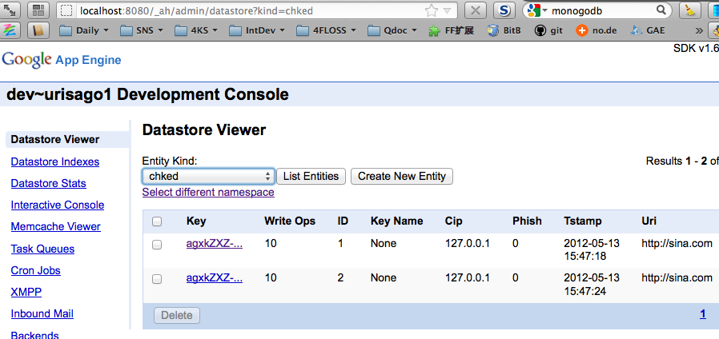
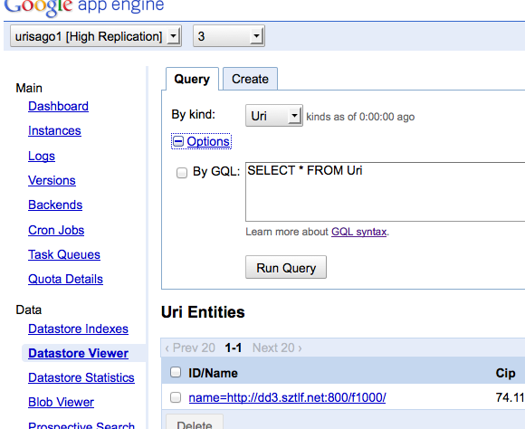

.. include:: ../LINKS.rst

37:02" 重构
============================

结构化代码
---------------------

因为生成查询链接,访问外部服务,的行为,将在不同的情况中反复执行

- 所以,先快速重构代码
- 将原先的 `func chk(w http.ResponseWriter, r *http.Request)` 简化成

.. code-block:: go

    func chk(w http.ResponseWriter, r *http.Request) {
        c := appengine.NewContext(r)
        url := r.FormValue("uri")
        
        api_url := _genKSCuri(url)

        s,p := _asKSC(api_url, r)
        c.Infof("Success:%v \t Phish:%s", s ,PHISHID[p])

        fmt.Fprint(w, "/chk(KCS):\t" + PHISHID[p])
    }

- 当然配套的函式为:

    - `func _genKSCuri(url string) string`
    - `func _asKSC(uri string, r *http.Request) (int, int)`

詳細代码如下

.. code-block:: go

    type KSC struct {
        Success int    //`json:"success"`
        Phish   int //`json:"phish"`
        Msg     string //`json:"msg"`
    }

    func _genKSCuri(url string) string {
        println("url len~\t ", len(url))
        maxEncLen := base64.URLEncoding.EncodedLen(len([]byte(url))) 
        println("maxEncLen~\t ", maxEncLen)
        dst := make([]byte, maxEncLen) //<~ 整来的代码,不理解,就一定会出问题...
        base64.URLEncoding.Encode(dst, []byte(url))
        println("base64~\t", string(dst))
        args := "appkey=" + APPKEY
        args += "&q=" + string(dst)
        now := time.Now()
        nano := strconv.FormatInt(now.UnixNano(),10)
        args += "&timestamp=" + nano[0:10] + "." + nano[10:13]
        sign_base_string := APITYPE + "?" + args 
        println("sign_base_string~\t ", sign_base_string)
        //md5 hash 严格参数顺序:: appkey -> q -> timestamp
        h := md5.New()
        io.WriteString(h, sign_base_string + SECRET)
        args += "&sign=" + hex.EncodeToString(h.Sum(nil))
        println("sign~\t ", hex.EncodeToString(h.Sum(nil)))
        println("args~\t ", args)
        api_url := "http://"+ APIHOST + APITYPE + "?" + args 
        println("api_url~ ", api_url)

        return api_url
    }

    func _asKSC(uri string, r *http.Request) (int, int) {
        c := appengine.NewContext(r)
        client := urlfetch.Client(c)
        resp, err := client.Get(uri)
        if err != nil {
            panic(err)
        }
        c.Infof("HTTP GET returned status %v", resp.Status)
        if resp.StatusCode != 200 {
            panic(err)
            c.Infof("couldn't get sale data %v", http.StatusInternalServerError)
        }
        defer resp.Body.Close()
        c.Infof("resp.ContentLength %v", resp.ContentLength)
        var buf []byte
        buf, _ = ioutil.ReadAll(resp.Body)
        c.Infof("resp.Body %v", string(buf))

        result := &KSC{}
        err = json.Unmarshal(buf, result)
        if err != nil {
            panic(err)
        }
        
        return result.Success, result.Phish
    }

上Datastore
---------------------

`Datastore Overview - Google App Engine — Google Developers <https://developers.google.com/appengine/docs/go/datastore/overview>`_

- 这当然是 `GAE`_ 提供的
- MySQL 神马的,就表想了,,,没味道的,,,

.. code-block:: go

    import (
        "fmt"
        "time"

        "appengine"
        "appengine/datastore"
        "appengine/user"
    )

    type Employee struct {
        Name     string
        Role     string
        HireDate time.Time
        Account  string
    }

    func handle(w http.ResponseWriter, r *http.Request) {
        c := appengine.NewContext(r)

        e1 := Employee{
            Name:     "Joe Citizen",
            Role:     "Manager",
            HireDate: time.Now(),
            Account:  user.Current(c).String(),
        }

        key, err := datastore.Put(c, datastore.NewIncompleteKey(c, "employee", nil), &e1)
        if err != nil {
            http.Error(w, err.Error(), http.StatusInternalServerError)
            return
        }

        var e2 Employee
        if err = datastore.Get(c, key, &e2); err != nil {
            http.Error(w, err.Error(), http.StatusInternalServerError)
            return
        }

        fmt.Fprintf(w, "Stored and retrieved the Employee named %q", e2.Name)
    }

例程非常简洁明了的,,,

但是!
^^^^^^^^^^^^^^^^^^^

例程的逻辑是:

- 先填好一个结构数据体,并使用 `datastore.NewIncompleteKey` 生成鍵值
- 然后塞到 `Datastore` 中
- 最后使用之前的 鍵值 从 `Datastore` 取回数据

然而,俺进行的逻辑是:

- 先从 `Datastore` 尝试是否有对应数据
- 如果没有, 从 金山云 查询到结果, 组成结构体, 再塞入  `Datastore` 

问题就在:

- 如何根据指定的条件, 生成合理的  `Datastore` 鍵值来进行查询?!
- 明显的,  `Datastore` 不是 `Python`_ 的字典,也不是 `Go`_ 的 `map` 其值对的 键值 不是由用户人指定的数据,而是对分布式管理有帮助的 唯一 hash 值....

先蒙一下...

.. code-block:: go

    // ...
    func qchk(w http.ResponseWriter, r *http.Request) {
        c := appengine.NewContext(r)
        url := r.FormValue("uri")

        ukey := datastore.NewKey(c, "Uri", url, 0, nil)
        var e2 Chked
        if err := datastore.Get(c, ukey, &e2); err != nil {
            fmt.Fprint(w, "~ ", err.Error() , "\n")
            c.Infof("Get Err.~\n\t !!! %v", err.Error())
            api_url := _genKSCuri(url)
            _,p := _asKSC(api_url, r)
            c.Infof("Success:%v \t Phish:%s", s ,PHISHID[p])

            e1 := Chked{
                Uri:    url,
                Phish:  p,
                Tstamp: time.Now(),
                Cip:    r.RemoteAddr,
            }
            key, err := datastore.Put(c, datastore.NewIncompleteKey(c, "chked", nil), &e1)

            if err != nil {
                http.Error(w, err.Error(), http.StatusInternalServerError)
                return
            }
            c.Infof("datastore key=%v", key.String())
            fmt.Fprint(w, "/qchk(KCS):\t" + PHISHID[p])
        }else{
        //...
    

- 使用文档中抄来的 
- `func NewKey(c appengine.Context, kind, stringID string, intID int64, parent *Key) *Key` 
- 通过结构数据中指定值对为条件,生成 鍵值,尝试查询

    - `The datastore package - Google App Engine — Google Developers <https://developers.google.com/appengine/docs/go/datastore/reference>`_

- 然后,使用例程中的 
- `func NewIncompleteKey(c appengine.Context, kind string, parent *Key) *Key` 
- 生成新值对的鍵!

    - 这里纠结的是其中的 `kind string` 类别参数?!
    - 理解,应该是类似 `MongoDB`_ 中的不同 数据库的名称
    - 即,可以根据 类型,将不同的数据值对,放到指定的 `类别` 存储中
    - 但是, `datastore.NewKey` 时,可没有这参数吼?!

一运行才发现,不論怎么尝试,永远:

- 日志输出: `~ datastore: no such entity`
- 但是,从 `http://localhost:8080/_ah/admin/` `GAE`_ 的 SDK 提供的本地管理界面中
- 如 :ref:`fig_2_1` 所示

.. _fig_2_1:

   插图.2-1 本地的Datastore Viewer界面

- 数据的确塞入了 `Datastore` 
- 但是! 相同的数据, 鍵值都不相同!!

.. note:: PS:

    - 当然的, `GAE`_ 的实际运行服务管理后台,也提供了相同的数据观察入口
    - 只是界面更加精致而已
    - 如 :ref:`fig_2_2` 所示

.. _fig_2_2:

   插图.2-2 GAE的Datastore Viewer界面

鍵要统一!
^^^^^^^^^^^^^^^^^^^

怎么办呢!?

- 尝试搜索
- 见到: `gae datastore get , return value is wrong.. - golang-nuts <http://groups.google.com/group/golang-nuts/browse_thread/thread/996aa7e83aa29fde/f73e109d94735a00?show_docid=f73e109d94735a00>`_

.. code-block:: go

    ///////////////////////// sample.go
    type Val struct {
      int Value
    }

    retry:=""
    var v Val
    for {
      v.Value=-1
      for {
          if e:=datastore.Get(c,datastore.NewKey(c,"Ent","Key",
    0,nil),&v);e==nil{
            break
          }else{
            retry+=e.Error()+","
            sleep(10)
          }
      }
      fmt.Printf("%s, %d",retry, v.Value)   //if process is true, v.Value
    is 32 or include some retry message ,32
    } 

- 嗯嗯嗯?! 这 `datastore.NewKey()` 生成的鍵是可以直接应用在 `datastore.Get()` 中的哪?!

.. code-block:: go

    // ...
    func qchk(w http.ResponseWriter, r *http.Request) {
        c := appengine.NewContext(r)
        url := r.FormValue("uri")

        ukey := datastore.NewKey(c, "Uri", url, 0, nil)
        var e2 Chked
        if err := datastore.Get(c, ukey, &e2); err != nil {
            fmt.Fprint(w, "~ ", err.Error() , "\n")
            c.Infof("Get Err.~\n\t !!! %v", err.Error())
            api_url := _genKSCuri(url)
            _,p := _asKSC(api_url, r)
            c.Infof("Success:%v \t Phish:%s", s ,PHISHID[p])

            e1 := Chked{
                Uri:    url,
                Phish:  p,
                Tstamp: time.Now(),
                Cip:    r.RemoteAddr,
            }
            //key, err = datastore.Put(c, datastore.NewIncompleteKey(c, "chked", nil), &e1)
            ukey, err = datastore.Put(c, ukey, &e1)
            if err != nil {
                http.Error(w, err.Error(), http.StatusInternalServerError)
                return
            }
            //c.Infof("datastore key=%v", key.String())
            fmt.Fprint(w, "ask KCS API srv.\n")
            fmt.Fprint(w, "/qchk(KCS):\t" + PHISHID[p])
        }else{
        //...

就修改两行!    

::

    $ curl -d "uri=http://sina.com" localhost:8080/qchk
    ~ datastore: no such entity
    ask KCS API srv.
    /qchk(KCS):     好站
    
    $ curl -d "uri=http://sina.com" localhost:8080/qchk
    datastore Get OK;-) 
    /qchk(GAE):     好站

**BINGO!**

42:01" 小结
---------------------------------

~ 这一处增强,纯粹是根据文档配合后台日志,尝试几个回和而已,5分钟,整出来不难吧?

- 但是,过程中的心理冲突,绝对不轻
- 比如,文档中未言明的各种细节, 是否重要? 怎么测试确认?
- 等等,都需要补课,老实查阅文档,认真领悟,大胆尝试,建立靠谱的思路和反应,,,

不过,整体上,只要思路明确,方向正确,真心只是个轻松的过程而已,,,

